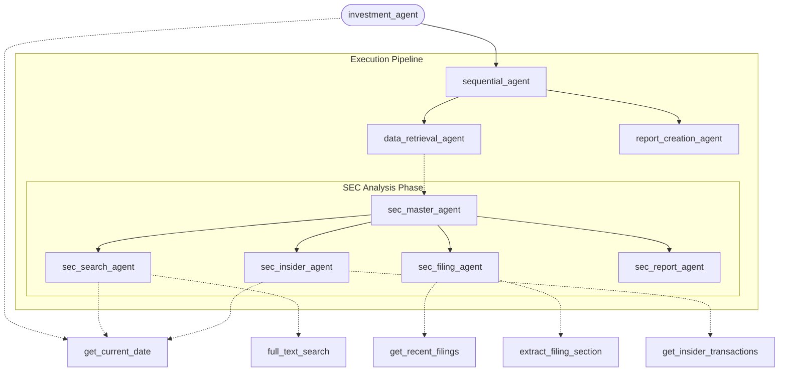

# SEC Agent (Google ADK)

This project contains a financial analysis agent built using the **Google Agent Development Kit (ADK)** and the [sec-api](https://sec-api.io/). The agent is designed to autonomously query, retrieve, and analyze SEC EDGAR filings (such as 10-Ks, 10-Qs, and 8-Ks). It features specialized subagents coordinated by a master sequential agent to fetch data and generate structured financial reports.

## Features & Subagents
- **sec_search_agent**: Performs broad, full-text searches across the SEC database for specific topics or keywords.
- **sec_filing_agent**: Locates recent filings for targeted tickers and extracts specific sections (e.g., "Risk Factors" or "Management's Discussion") for deep-dive analysis.
- **sec_insider_agent**: Retrieves and analyzes insider trading transactions (Forms 3, 4, 5) for specific companies.
- **sec_report_agent**: Synthesizes the retrieved filing text and insider trading data into a comprehensive financial analysis report.

## Agent Architecture



## Who Benefits from This Agent?
- **Financial Analysts & Researchers**: Automates the tedious process of digging through the EDGAR database, instantly surfacing relevant sections like 10-K Risk Factors or MD&A without manual downloading and parsing.
- **Investment Firms**: Allows rapid scanning of the market for macro-trends by using full-text search across thousands of recent 8-Ks and 10-Qs (e.g., tracking the adoption of "artificial intelligence" in forward-looking statements).
- **Compliance & Risk Teams**: Monitors changes in competitor disclosures or industry-wide risk factors efficiently.

## Recent Changes

### Insider Trading Agent Integration
A new specialized agent, `sec_insider_agent`, has been added to retrieve and analyze insider trading activity (via SEC Forms 3, 4, and 5). The `sec_report_agent` has been updated to incorporate these insider trading insights into the final investment report.

### Gemini 3.1 Pro Configuration
The configuration has been updated to use `gemini-3.1-pro-preview` as the default model. When running the full agent pipeline, it is recommended to ensure the global endpoint is accessible (see Setup Instructions).

## Prerequisites

1. **Google Cloud Project**: You need an active Google Cloud Project with Vertex AI and Secret Manager APIs enabled.
2. **Python Environment**: The agent is configured to run with `python3.12`.
3. **sec-api Account**: You need an API key from [sec-api.io](https://sec-api.io/).

## Setup Instructions

### 1. Configure the SEC API Key
The agent retrieves its API key securely from Google Cloud Secret Manager. 

1. Go to Google Cloud Console > Security > Secret Manager.
2. Create a new secret named exactly **`SECAPIKey`**.
3. Add your sec-api.io API key as the secret value.

### 2. Configure Local Authentication
The agent uses your Google Cloud Application Default Credentials (ADC) to access Secret Manager and Vertex AI.

```bash
gcloud auth application-default login
gcloud config set project YOUR_PROJECT_ID
```

### 3. Install Packages
Ensure your local Python 3.12 environment has the required libraries:

```bash
pip install google-adk sec-api google-cloud-secret-manager
```

## Sample Prompts

Once the agent is running, try the following prompts to see its capabilities:

- *"Analyze the latest 10-K risk factors for TSLA and identify any new risks related to supply chain."*
- *"Analyze insider trading for TSLA over the past year."*
- *"Find recent 8-K filings for AAPL regarding leadership changes."*
- *"Summarize the 'Management's Discussion and Analysis' section of MSFT's latest 10-Q."*
- *"Search the SEC full text database for mentions of 'inflation expectations' by retail companies in the last 30 days."*

## Deployment to AgentEngine

You can easily deploy this agent construct to Google Cloud's AgentEngine using the ADK CLI.

1. Ensure your `adk` CLI is installed and configured with your target GCP project.
2. From the root of this repository, run the `adk deploy` command targeting the root agent instance in `agent.py`:

```bash
adk deploy --project YOUR_PROJECT_ID --agent edgar_agent.agent:root_agent --name sec-financial-agent
```

This will package your agent logic, tools, and configurations, and deploy them to Vertex AI AgentEngine, giving you a scalable, managed endpoint to interact with your SEC Agent.

## Running Evaluations

This project includes a suite of evaluations to verify the agent's performance and accuracy.

### Why Evaluations Matter

Evaluations (evals) are critical for maintaining the reliability and accuracy of the SEC Agent as it evolves. They provide a structured way to test the agent's performance against specific scenarios and criteria.

Key benefits of running evals include:

- **Regression Testing:** Ensure that future changes—such as updating models, refactoring tools, or adding new features—do not break existing capabilities or degrade response quality.
- **Model Comparison:** Objectives compare the performance of different Gemini models (e.g., comparing `gemini-2.5-flash` with `gemini-3.1-pro-preview`) on financial analysis tasks.
- **Quality Assurance:** Verify that the agent's reasoning remains grounded in actual SEC filings and prevents the introduction of hallucinations.
- **Continuous Improvement:** Provide a benchmark to measure improvements as you refine prompts, instructions, or subagent coordination.

By integrating evals into your development workflow (e.g., before merging changes or deploying updates), you ensure the agent remains a trustworthy tool for investment research.

### How to use evaluations in the future (Examples)

Here are examples of how you can apply evaluations to different scenarios:

#### 1. Regression Testing (Pre-Commit/Pre-Deploy)
*   **Scenario:** You determine that the `edgar_agent` instructions can be made more concise.
*   **Action:** Before committing the change, run `MOCK_SEC_API=true adk eval edgar_agent sec_eval_set --config_file_path evals/eval_config.json --print_detailed_results`.
*   **Value:** If the score drops below 1.0 (e.g., the agent missed a risk factor it used to catch), you know your instruction change caused a regression.

#### 2. Model Comparison (Upgrading Gemini)
*   **Scenario:** Google releases a new model, e.g., `gemini-4.0-pro`.
*   **Action:** 
    1. Update `agent.py` to use the new model (temporarily).
    2. Run the evaluation command with Mock Mode.
    3. Compare the detailed results with previous runs.
*   **Value:** Objective proof that the new model performs better (or just as well) on your specific tasks before making the switch.

#### 3. Quality Assurance (Expanding Capabilities)
*   **Scenario:** You add a new tool to fetch financial ratios.
*   **Action:** 
    1. Create a new evaluation dataset (e.g., `evals/ratio_eval_set.json`).
    2. Run `adk eval` against this new set.
*   **Value:** Validates that the new tool works as expected and the agent knows how to use it correctly without breaking existing logic (cross-validation).

#### 4. Continuous Improvement (Prompt Engineering)
*   **Scenario:** You noticed the agent's report format is inconsistent.
*   **Action:** 
    1. Update instructions with strict formatting rules.
    2. Run the evaluation.
    3. Review the detailed results to see if the formatting rubric passes.
*   **Value:** Objective feedback on whether your prompt engineering efforts actually fixed the issue without affecting accuracy.

### Configuration

- **Dataset:** `evals/eval_session_input.json` contains the evaluation cases (e.g., analyzing TSLA 10-K risk factors).
- **Config:** `evals/eval_config.json` specifies the evaluation metrics and thresholds.

### How to Run

To run the evaluations, use the `adk eval` command. 

**Important:** To avoid hitting API rate limits of the SEC API during testing, it is highly recommended to enable **Mock Mode**. This instructs the tools to return realistic predefined data instead of making live API calls.

Run the following command from the root of the repository:

```bash
MOCK_SEC_API=true adk eval edgar_agent sec_eval_set --config_file_path evals/eval_config.json --print_detailed_results
```

This command will:
1. Enable Mock Mode (`MOCK_SEC_API=true`).
2. Run the `edgar_agent` against the `sec_eval_set` dataset.
3. Use the configuration file specified.
4. Print detailed results to the console.

### Interpreting Results

The evaluation framework will score the agent's responses against defined rubrics. A successful run will show a score of `1.0` for the relevant metrics and an exit code of `0`.

Detailed evaluation history is stored in the `.adk/eval_history` directory.

## License

This project is licensed under the MIT License - see the [LICENSE](LICENSE) file for details.
